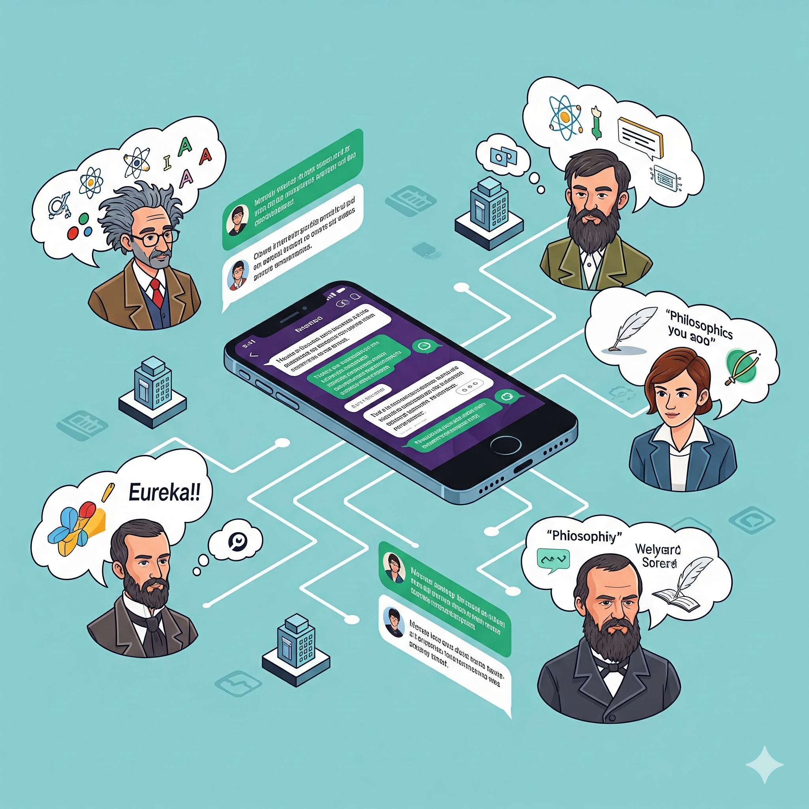
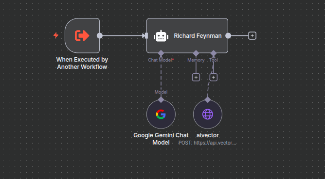
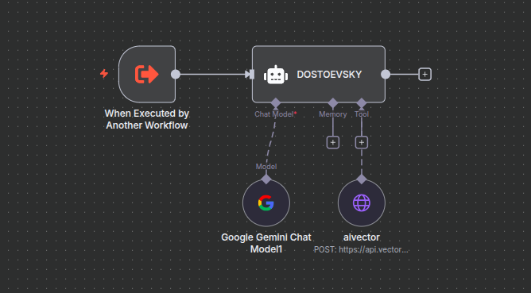
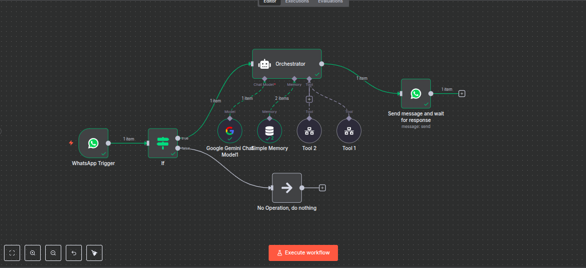

# 🤖 Multi-RAG Agent System

*An intelligent conversational platform powered by specialized AI personalities and advanced retrieval-augmented generation*

A sophisticated WhatsApp chatbot system that integrates multiple AI agents and tools to provide intelligent responses and automated workflows.

## Overview

This project implements a WhatsApp chatbot that leverages AI agents (including Google Gemini, Richard Feynman persona, and DOSTOEVSKY) along with various tools and memory systems to create an intelligent conversational experience.

## Architecture

The system consists of several interconnected workflows:

### Main Workflow
- **WhatsApp Trigger**: Receives incoming messages from WhatsApp
- **AI Agent1**: Primary AI agent with chat model and memory capabilities
- **Conditional Logic**: Routes messages based on conditions
- **Tools Integration**: Connects to Tool 1 and Tool 2 for extended functionality
- **Response System**: Sends processed responses back to WhatsApp

### Sub-Workflows
- **Richard Feynman Agent**: Specialized AI agent with Google Gemini Chat Model and AI Vector integration with custom knowledge to enhance the response for the agent 

- **DOSTOEVSKY Agent**: Literary-focused AI agent with RAG pipeline built on "Crime and Punishment" text for authentic literary discussions and more books 

## Features

- 🤖 Multiple AI personalities and specialized agents
- 💾 Persistent memory system for context retention
- 🔧 Extensible tool integration
- 📱 WhatsApp integration for seamless messaging
- 🔄 Workflow-based message processing
- 🧠 Vector-based AI knowledge retrieval with literary corpus (vector store)

## Workflow Components

### Triggers
- **WhatsApp Trigger**: Initiates workflow on incoming messages
- **Manual Execution**: Allows manual workflow execution

### AI Agents
- **AI Agent1**: Primary conversational agent
- **Richard Feynman**: Scientific explanation specialist
- **DOSTOEVSKY**: Literary and philosophical discussions powered by Crime and Punishment RAG pipeline
